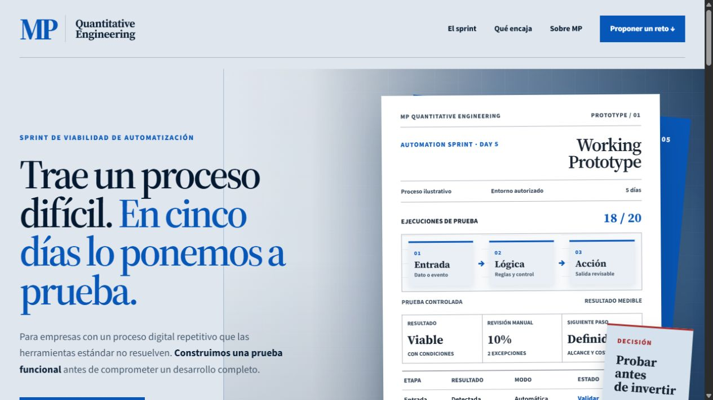
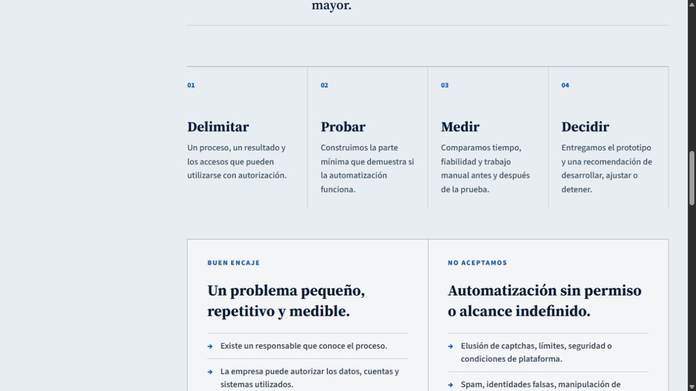
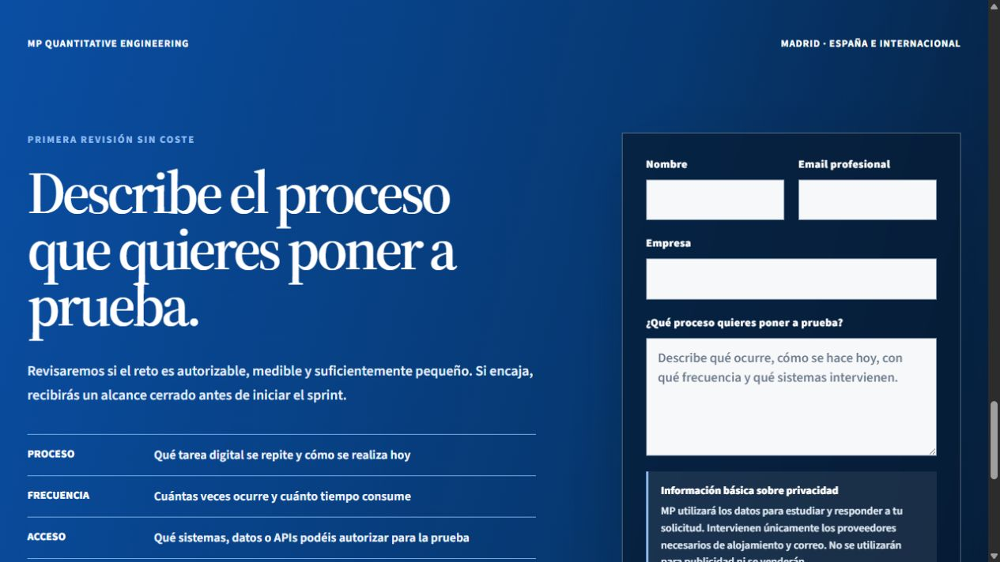
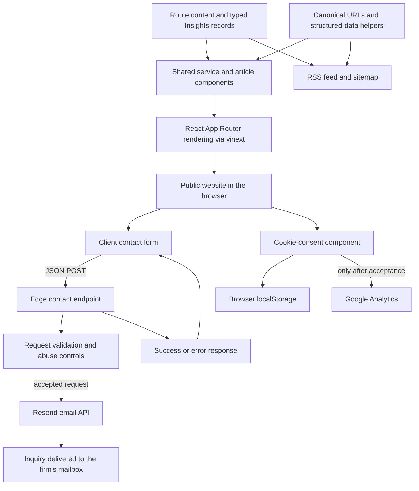

# MP Quantitative Engineering

### Put the difficult step to the test before committing to the full build.

The website for a **five-day automation feasibility sprint**: define one difficult digital process, build a scoped working prototype, measure what happens and decide whether to develop, adjust or stop.

**[Explore the website →](https://www.mpquantitative.com)**

*Actual public website, captured on September 12, 2026. The page's Working Prototype panel is an illustrative example, not client data or measured project results. The original Spanish interface is preserved.*

## What the website helps a visitor decide

An automation idea often starts with an expensive uncertainty: whether a difficult step can work reliably enough to justify building the whole system. MP presents a smaller first decision—test that step within a defined scope.

The site explains the sprint, the evidence it is intended to produce and the conditions that make a case suitable. Visitors can review the working method, explore related software services and send a structured description of their process. The outcome being offered is a technical decision with a prototype and documented limits; a complete production system is a separate scope.

## The five-day sprint

| Stage | What the service sets out to establish |
| --- | --- |
| **Scope** | One process, an observable result, a responsible owner and the systems that can be accessed with permission. |
| **Test** | The smallest functional prototype that exercises the uncertain part of the workflow. |
| **Measure** | Time, reliability, exceptions and remaining manual effort, compared with the current process. |
| **Decide** | A recommendation to develop, change the approach or stop, with the limits and next scope made explicit. |

*The live website's four-stage method and scope criteria, captured on September 12, 2026.*

The detailed sprint and methodology pages expand this into initial scoping, construction, testing and a final demonstration. The listed deliverables include the prototype or technical demonstration, a record of failures and dependencies, and a recommendation about further development. A negative feasibility result is a valid outcome of the offer.

## An intake built around the process

The contact section asks for the context needed to assess a case: who is responsible, which company is involved, what happens today, how often it happens and which systems participate. Privacy information appears next to the form, and acknowledgment is required.

The implemented form sends a structured request to the site's contact endpoint. It provides sending, success and error feedback, resets after success and offers a direct contact alternative when delivery fails. The endpoint checks the request before passing an email to the configured delivery provider.

*The actual empty intake form on the public website, captured on September 12, 2026. No customer information or submitted inquiry is shown.*

## Beyond the landing page

The website includes dedicated pages for the sprint, methodology, custom software, demand forecasting, inventory and purchasing or production planning. An Insights section contains nine structured guides covering software decisions, implementation, forecasting validation and operational planning.

These are connected editorial pages with direct answers, related reading, FAQs where relevant, canonical metadata and structured data. The same content model supports the article index and RSS feed. The result is a navigable explanation of the work, rather than a single disconnected sales page.

## Architecture

The diagram describes the implementation of the website and inquiry channel. Client automation prototypes are separate projects; they are not services running behind the demonstration panel.

| Layer | Actual implementation |
| --- | --- |
| Website | React and TypeScript with Next.js-compatible App Router components, built through vinext and Vite |
| Content | Shared service/article templates, typed editorial records, FAQs and related-page navigation |
| Presentation | Custom responsive CSS, locally served fonts, public imagery and reduced-motion behavior |
| Discovery | Canonical metadata, JSON-LD, sitemap and an RSS feed generated from the editorial records |
| Inquiry channel | Client form → edge route → Resend email delivery, with validation and explicit feedback |
| Analytics | Consent-controlled loading, with the preference stored in the browser |

The public-site routes do not use a customer database or account system. Optional database and authentication helpers present in the development starter are not shown as active website features. Contact delivery depends on the production email-service configuration.

## Scope and evidence

The screenshots show the real public site. The architecture is grounded in the inspected implementation, including its content templates, contact route and consent components. The website's sample prototype panel communicates the form of an engagement; its example values are not customer results. Forecasting and inventory pages describe professional services, not a live forecasting engine embedded in the website.

## About this repository

This repository is the public showcase for MP Quantitative Engineering's website. It contains an English explanation, authentic page captures and an implementation-based architecture diagram. The source code and operational configuration remain private.

**Last showcase review:** 2026-09-12 (Europe/Paris).
